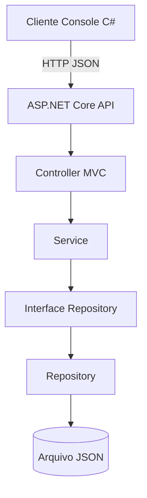
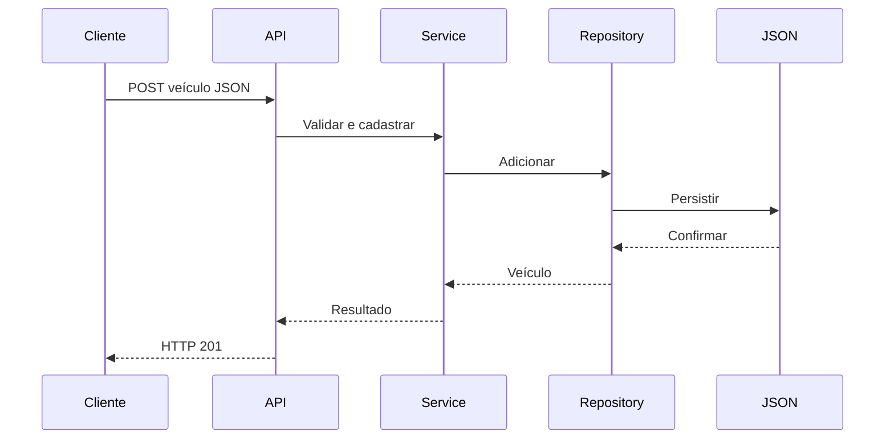

# Diagramas

## Componentes

```mermaid
flowchart TD
 A[Cliente Console C#] -->|HTTP JSON| B[ASP.NET Core API]
 B --> C[Controller MVC]
 C --> D[Service]
 D --> E[Interface Repository]
 E --> F[Repository]
 F --> G[(Arquivo JSON)]
```

## Sequência de cadastro

```mermaid
sequenceDiagram
 participant Cliente
 participant API
 participant Service
 participant Repository
 participant JSON
 Cliente->>API: POST veículo JSON
 API->>Service: Validar e cadastrar
 Service->>Repository: Adicionar
 Repository->>JSON: Persistir
 JSON-->>Repository: Confirmar
 Repository-->>Service: Veículo
 Service-->>API: Resultado
 API-->>Cliente: HTTP 201
```
